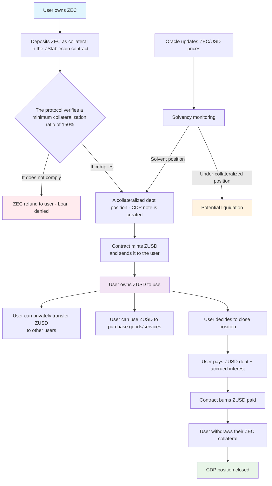

# ZUSD - A Private Stablecoin built with Aztec and Zcash

ZUSD is a privacy-focused stablecoin protocol built on the [Aztec Network](https://aztec.network/) that enables users to collateralize ZEC ([Zcash](https://z.cash/)) to generate ZUSD, a USD-pegged stablecoin with zero-knowledge privacy features.

## Table of Contents
- [Overview](#overview)
- [Architecture](#architecture)
- [How It Works](#how-it-works)
- [Key Features](#key-features)
- [Contracts](#contracts)
- [Setup](#setup)
- [Development](#development)
- [Testing](#testing)
- [Security](#security)
- [Team](#team)

## Overview

ZUSD is a decentralized, privacy-preserving stablecoin protocol that allows users to generate ZUSD stablecoins by depositing ZEC (Zcash) as collateral. The system maintains a minimum collateralization ratio of 150%, meaning users must deposit at least $150 worth of ZEC to borrow $100 worth of ZUSD.

The protocol leverages Aztec Network's zero-knowledge technology to provide complete privacy for user positions, balances, and transactions while maintaining the stability of a traditional stablecoin.

## Architecture

The ZUSD protocol consists of three interconnected contracts:

### 1. ZStablecoin Contract (main.nr)
- Manages collateralized debt positions (CDPs)
- Controls minimum collateral ratios (150%)
- Handles position opening/closing
- Tracks and accrues interest on outstanding debt
- Performs solvency checks for liquidation purposes

### 2. ZUSD Token Contract (zusd_token.nr)
- Implements the ZUSD stablecoin with private transfers
- Uses Aztec's PrivateSet for confidential balance storage
- Only mintable/burnable by the ZStablecoin vault contract
- Public total supply tracking for transparency

### 3. Simple Oracle Contract (ZcashOracle.nr)
- Provides ZEC/USD price feeds for collateralization calculations (for now, just one admin updates the value)
- Admin-controlled price updates (with plans for decentralized oracles)
- Used to determine if positions maintain proper collateralization

## How It Works

1. **Position Opening**: Users deposit ZEC collateral into the ZStablecoin contract and borrow ZUSD against it, maintaining a minimum 150% collateralization ratio.

2. **Interest Accrual**: The system accrues interest on outstanding debt through an interest index that increases over time.

3. **Private Transfers**: ZUSD can be transferred privately using Aztec's confidential transaction technology.

4. **Position Closing**: Users repay their ZUSD debt plus accrued interest to retrieve their ZEC collateral.

5. **Liquidation Protection**: The protocol includes solvency checks to identify undercollateralized positions.

## Flow Diagram



## Key Features

- **Complete Privacy**: All user balances and positions are private by default
- **Decentralized**: No centralized control over stablecoin issuance
- **Over-collateralization**: Maintains 150% minimum collateralization for stability
- **Interest-bearing**: Users pay interest on borrowed amounts
- **ZK**: Built on Aztec's privacy technology for secure, private transactions

## Setup

### Prerequisites
- Node.js v22
- Yarn package manager
- Aztec Sandbox (for local development)

- **This project assumes there is a ZEC token deployed in the Aztec network**.

### Getting Started
1. Clone the repository
2. Install dependencies: `yarn install`
3. Start the Aztec sandbox: `aztec start --sandbox`
4. Compile contracts: `yarn compile`
5. Generate TypeScript artifacts: `yarn codegen`

### Configuration
The project supports different environments (local, devnet) using configuration files in the `config/` directory.

## Development

### Contract Compilation
```bash
# Compile Noir contracts
yarn compile

# Generate TypeScript artifacts
yarn codegen
```


### Deployment
```bash
# Deploy to local sandbox
yarn deploy

# Deploy to devnet
yarn deploy::devnet
```

## Security

This project is in beta, required more development before use in production. Key considerations:

- The oracle implementation is currently centralized and should be replaced with a decentralized solution for production
- Proper risk management includes the 150% minimum collateralization requirement
- All contract interactions are built using Aztec's secure zero-knowledge primitives

## Next steps

- [x] Build the proof of concept.
- [ ] Enable a web app to interact with ZUSD.
- [ ] Allow investors and stakers join and receive interests for their investments (lend and borrow).
- [ ] Improve contracts and test.
- [ ] Auditing protocol. 

## Team

This project was developed by the [Techgethr](https://www.techgethr.com/) team. 
